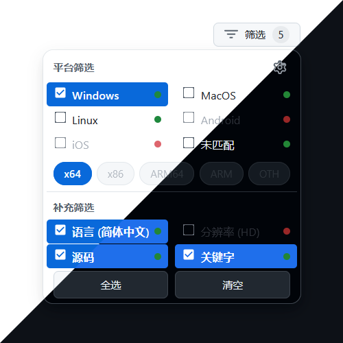
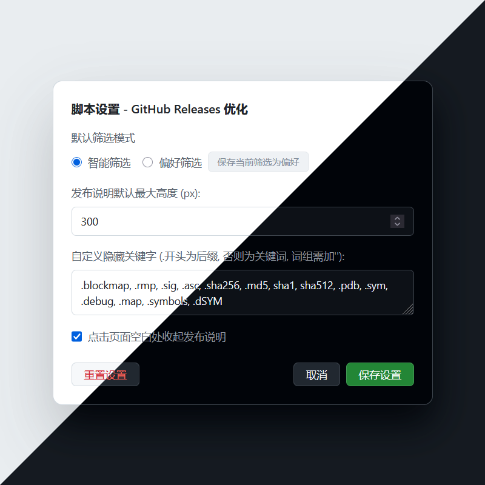
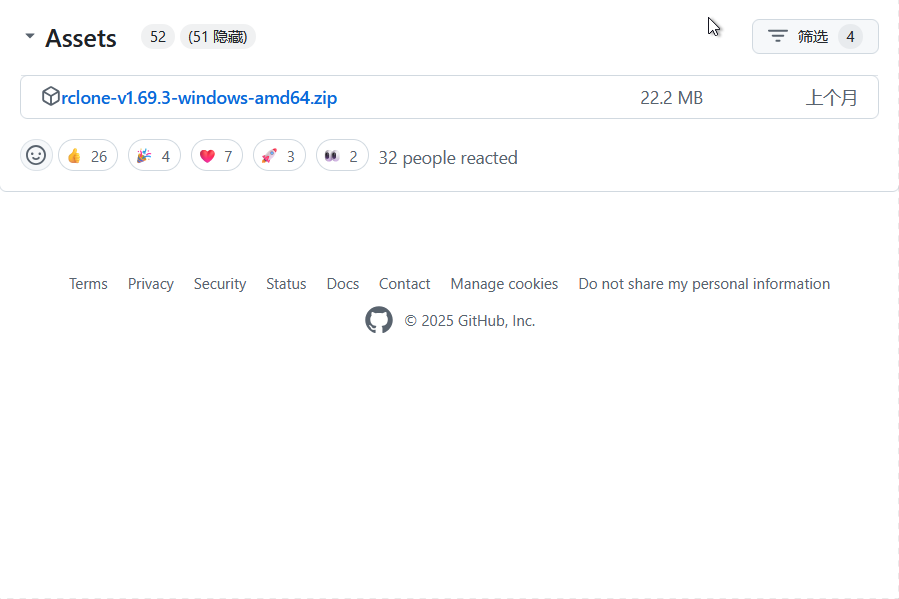
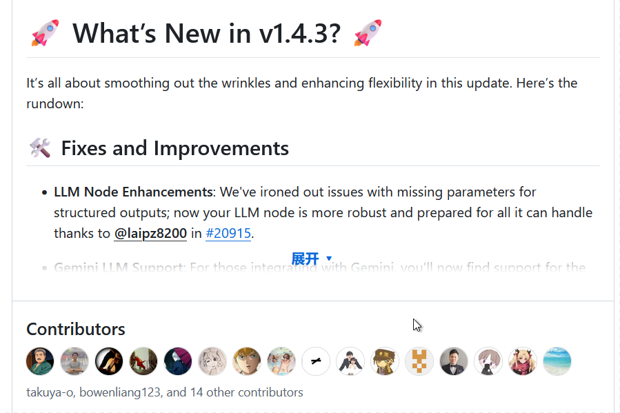

# ⚙️ GitHub Releases 浏览优化

> 🚀 本脚本基于 [eecopilot/github-release-platform-filter](https://github.com/eecopilot/github-release-platform-filter) (v0.3.3) 大幅重构和功能增强而来，由 🤖**Gemini** 强力驱动。特别感谢原作者的贡献！

此脚本旨在解决浏览 GitHub Releases 页面时的常见痛点，通过强大的筛选功能和界面优化，帮您快速定位所需文件。

## ✨ 主要功能

相较于早期版本，v2.0 版本完全重构代码，引入了全新的响应式状态管理核心，并带来了大量功能增强和体验优化。

### 核心功能

-   **智能筛选**：默认情况下，脚本会**自动检测您的操作系统和CPU架构**，并优先为您筛选出最匹配的资源。
   
-   **多维度筛选**：
   
    -   **平台筛选**：支持 Windows, macOS, Linux, Android, iOS 等主流平台。
       
    -   **架构筛选**：支持 x64, x86, ARM64, ARM 等，并会根据所选平台动态更新可用性。
       
    -   **补充筛选**：可根据您的**语言**、**屏幕分辨率**进行匹配筛选。
       
    -   **关键字筛选**：强大的自定义隐藏规则，可按**后缀**（如 `.sig`）或**关键字**（如 `debug`, `'source code'`）隐藏不需要的文件。
       
-   **偏好模式**：您可以将当前最常用的筛选组合一键**保存为个人偏好**，并在后续访问时自动应用。
   
-   **UI/UX 优化**：
   
    -   **动态计数器**：筛选器按钮上会实时显示当前已生效的规则数量。
       
    -   **隐藏资产提示**：明确告知您当前有多少资源因筛选规则被隐藏。
       
    -   **可用性指示**：筛选选项后的彩色圆点清晰地标示出当前页面是否存在该类型的文件。
       
    -   **可撤销操作**：提供“恢复”按钮，一键撤销当前筛选操作。
       
-   **发布说明 (Release Notes) 优化**：
   
    -   长篇发布说明会自动折叠，保持页面整洁。
       
    -   支持**点击页面空白处自动收起**已展开的说明。
       
    -   可在设置中自定义折叠的高度。
       
-   **高度可配置**：
   
    -   提供独立的设置面板，所有核心功能均可自定义。
       
    -   支持一键重置所有设置为默认值。
       
-   **主题自适应**：使用 GitHub 原生的亮色与暗色模式。
   
-   **跨语言支持**：支持中/英文界面。
   

## 🌠 功能预览

### 筛选面板

### 设置中心

### 资源筛选

### 说明折叠

## 🛠️ 安装与使用

### 前置条件

-   您需要安装一个用户脚本管理器，例如：
   
    -   **Tampermonkey** (推荐，支持 Chrome, Microsoft Edge, Safari, Firefox 等)
       
    -   **Greasemonkey** (Firefox)
       
    -   **Violentmonkey** (Chrome, Firefox, Opera)

    -   **Scriptcat** (Chrome, Firefox)
       

### 安装步骤

1.  确保您的浏览器已安装上述任一用户脚本管理器。
   
2.  [**点击这里**](https://raw.githubusercontent.com/wha4up/GitHub-Releases-Navigation-Enhancer/main/GitHub-Releases-Navigation-Enhancer.user.js) 安装脚本。
   

### 使用方法

1.  **自动运行**：安装完成后，访问任何 GitHub Release 详情页，脚本将自动运行。
   
2.  **使用筛选器**：
   
    -   点击资源列表右上角的 **[筛选]** 按钮打开筛选面板。
       
    -   默认已启用**智能筛选**。您可以根据需要点选或取消任何平台、架构或补充规则。
       
    -   所有操作都将实时生效。
       
3.  **打开设置**：
   
    -   方法一：在筛选面板的右上角点击 **齿轮图标** ⚙️。
       
    -   方法二：通过浏览器右上角的 Tampermonkey 等扩展图标，在菜单中选择“GitHub Releases 优化设置”。
       
4.  **保存偏好**：在筛选面板勾选偏好选项后，打开设置。在设置面板中，切换到“偏好筛选”模式，然后点击“保存当前筛选为偏好”即可。
   

## 📝 其他说明

-   本项目仅供个人学习和交流使用。
   
-   脚本的平台、架构等信息均基于文件名分析，其准确性依赖于项目发布者的命名规范。
   
-   如果您有任何建议或发现 Bug，欢迎通过 [Issues](https://github.com/wha4up/GitHub-Releases-Navigation-Enhancer/issues) 提出。
   

## 📄 许可证

[MIT License](./LICENSE)